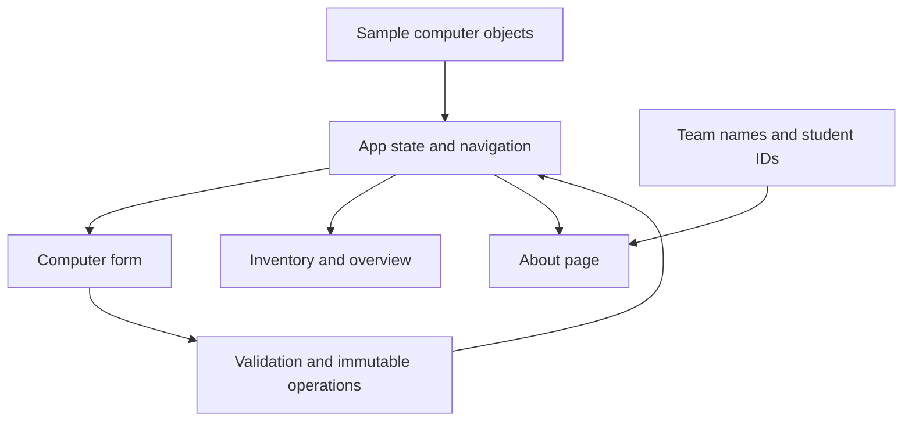

# FleetDesk architecture and technology stack

## Architecture

FleetDesk is a client-rendered React application. A single array of computer objects in `App` is the source of truth. Components receive records and callbacks through props. Domain functions validate, normalize, create, update, delete, filter, and summarize the collection.

This separates user input, state ownership, reusable controls, and business rules. It also keeps the future persistence work outside the present components. There is no backend in Part 1.

## Technology stack

| Technology                           | Purpose                                                               |
| ------------------------------------ | --------------------------------------------------------------------- |
| React and React DOM                  | Components, event handling, state, memoized derived values, rendering |
| JavaScript ES modules and JSX        | Application and domain logic                                          |
| Vite and its React plugin            | Local development and optimized static production build               |
| CSS Grid, Flexbox, media queries     | Styling and responsive layouts without a UI framework                 |
| Lucide React                         | Consistent interface icons; unused icons are omitted by the build     |
| Vitest and V8 coverage               | Automated tests, machine-readable reports, coverage                   |
| React Testing Library and user-event | User-facing component interaction tests                               |
| jsdom                                | DOM environment for component tests                                   |
| Oxlint                               | Static lint checks                                                    |
| Prettier                             | Consistent source formatting                                          |
| npm and package-lock.json            | Reproducible dependency installation                                  |

The exact resolved versions are in `package-lock.json`. The tested toolchain versions are recorded in `testing.md`. Node.js 24 is the recommended runtime for this project; the package also permits compatible Node.js 22 versions from 22.12 onward.

## Responsibilities

| File or component                | Responsibility                                                                                                   |
| -------------------------------- | ---------------------------------------------------------------------------------------------------------------- |
| `src/main.jsx`                   | Mounts the React root with Strict Mode and loads the stylesheet                                                  |
| `src/App.jsx`                    | Owns the computer collection, navigation, filtering, notifications, and selected record; composes the main views |
| `src/domain/assets.js`           | Central validation, normalization, immutable CRUD operations, search, sort, summary, and currency formatting     |
| `src/components/AssetForm.jsx`   | Shared add/edit form, controlled inputs, field errors, and input focus                                           |
| `src/components/AssetTable.jsx`  | Inventory table and record action buttons                                                                        |
| `src/components/Modal.jsx`       | Shared native dialog wrapper, labels, Escape handling, and focus restoration                                     |
| `src/components/StatusBadge.jsx` | Consistent text and color treatment for statuses                                                                 |
| `src/data/seedAssets.js`         | Fictional initial computer records                                                                               |
| `src/data/team.js`               | The two user-supplied team names and student IDs                                                                 |
| `src/index.css`                  | Shared design tokens, layout, components, responsive rules, focus states                                         |

## Computer data model

| Field          | JavaScript type | Meaning                                                       |
| -------------- | --------------- | ------------------------------------------------------------- |
| `id`           | string          | Immutable internal identity; a UUID for newly added computers |
| `tag`          | string          | Unique company asset tag                                      |
| `name`         | string          | Computer model or descriptive name                            |
| `serial`       | string          | Unique device serial number                                   |
| `type`         | string          | Laptop, Desktop, or Workstation                               |
| `status`       | string          | Assigned, Available, Maintenance, or Retired                  |
| `department`   | string          | Company department                                            |
| `assignedTo`   | string          | Person or team, or an empty string when unassigned            |
| `location`     | string          | Physical location                                             |
| `purchaseDate` | string          | Date in YYYY-MM-DD format                                     |
| `cost`         | number          | Purchase cost in SAR                                          |
| `notes`        | string          | Optional description or maintenance note                      |

Every initial record is validated by the test suite. Form values are strings while being edited; the cost is converted to a number when a valid record is saved.

## Data flow and state lifetime

1. On initial render, `App` clones the seeded objects into its own state array.
2. The user edits controlled form inputs. The original record is left unchanged.
3. On submit, shared validation reports field errors or permits saving. The data operation validates again at its boundary.
4. An add or update returns a new array. React receives that array and updates the table and derived summaries.
5. Delete requires a confirmation dialog before a new filtered array replaces the old one.

Object spread, `map`, and `filter` preserve immutability. Editing retains the internal `id`, so React keys and record selection remain stable even when the asset tag changes.

Records are held only in React memory. There is no `localStorage`, `sessionStorage`, IndexedDB, remote API, or database. Reloading the page creates the initial collection again. This behavior is stated in the interface.

## Navigation

The menu uses hash URLs: `#/computers`, `#/overview`, `#/add`, and `#/about`. The application listens for `hashchange`, so Back and Forward can change views without asking a server to resolve frontend routes. Unknown routes show the inventory. Edit is a contextual form within Computers; it is not a separately shareable URL.

## Derived information

Search normalizes case and splits the query into words. Each word must appear somewhere in the record's searchable text. Status and department restrictions are then combined with the text query. A filtered copy is sorted; the original array is never sorted in place.

Purchase value sums costs in integer halalas before converting back to SAR. The assignment rate is `Assigned / (Total - Retired) × 100`, rounded to a whole percentage. It is zero if no non-retired computers exist. Counts and totals include current state changes immediately.

## Part 2 extension point

Part 2 can replace the local data operations at the `App` boundary with manually implemented API calls. The future backend will need independent validation, authentication, authorization, persistence, uniqueness constraints, and error handling. These features are not present or simulated in Part 1.

## Primary documentation

- [React Quick Start](https://react.dev/learn) describes the component, event, and state model used here.
- [Vite guide](https://vite.dev/guide/) documents the development and build tooling.
- [Vitest guide](https://vitest.dev/guide/) documents the test runner and configuration.
- [React Testing Library introduction](https://testing-library.com/docs/react-testing-library/intro/) explains the rendered-component testing approach.
